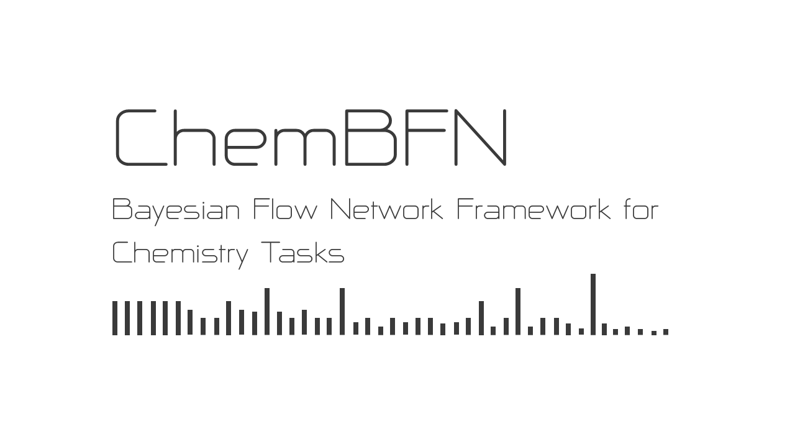

A project page usually has the main outcomes of that research, however, here I want this page to be more like a personal blog written down any interesting things encountered during the research. Since our paper are short, in my opinion, we encourage readers to check the results on their own.

## Paper

* Peer reviewed 
* Preprint 

## Blog

[13/02/2025] By quantising the model to *torch.qint8* format, the disk usage can be reduced by 3/4. The inference time (batch-size = 50, sequence-length = 59, sample-step = 10, sample-method = ODE) was improved from 2.96 s / molecule to 1.50 s / molecule on a laptop CPU (Intel Core i7-1165G7 @ 2.80GHz with 16G DDR4 RAM).

[22/01/2025] Readers may find our paper [*Bayesian Flow Network Framwork for Chemistry Tasks*](https://pubs.acs.org/doi/10.1021/acs.jcim.4c01792) published in JCIM is a little bit different from the [arXiv version](https://arxiv.org/abs/2407.20294). Don't worry, as it's well-known that the peer reviewed version is some kind of 'censored': we had to remove the result of ClinTox dataset because one reviewer criticised that a ROC-AUC > 0.99 was problematic. We leave readers judging it themselves.

[03/01/2025] I usually put [paperwithcode badges](https://paperswithcode.com/paper/a-bayesian-flow-network-framework-for) on the project README. I'm glad that for every few months the rankings of my model dropped a little bit: I know that our community has been developing better models for chemistry now! One day I found my model dropped, dramatically, from the top 5 to the last 10. I immedinately clicked the link to see what happened, from which, well, I laughed. A user added results saying that even vanilla GCN beated ChemBFN. I looked through the paper, 'oh it's from Cambridge'. Then it's more laughing: the authors didn't check the data splitting method and reported the results, even not be clearly stated in their paper, on the random split, even though the previous users and I on paperwithcode reported results from scaffold splits. Now the platform has been ruined by the silly researchers, and I removed the badges.

## We stand with Ukraine

